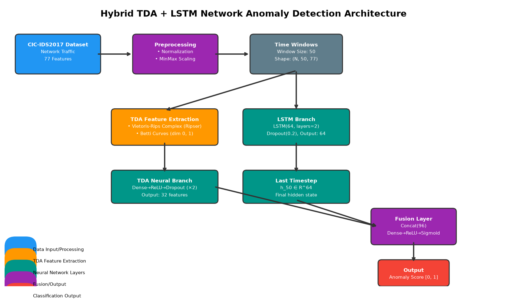

# Hybrid TDA+LSTM for Network Intrusion Detection

[](https://arxiv.org/abs/2606.31619)
[](LICENSE)
[](https://python.org)
[](https://pytorch.org)

> **Hybrid Topological Data Analysis and LSTM Networks for Enhanced Network Intrusion Detection Using CIC-IDS2017 Dataset**
>
> Amar Jeet, Bhaskar Ranjan Karn, Dinesh Kumar
>
> Department of Mathematics, Birla Institute of Technology, Mesra, Ranchi, India

## Overview

This repository contains the source code, experimental results, and paper source for our hybrid TDA+LSTM architecture for network intrusion detection. The approach combines **Topological Data Analysis (TDA)** — specifically persistent homology and Betti curves — with **Long Short-Term Memory (LSTM)** networks through a learned fusion network to detect anomalies in network traffic.

<p align="center">
  
</p>

## Key Results

Evaluated on the **CIC-IDS2017** dataset (2.8M+ labeled flows, 77 features, 14 attack categories):

| Model | AUC | F1-Score | Precision | Recall |
|-------|-----|----------|-----------|--------|
| **TDA+LSTM Hybrid** | **1.000** | **1.000** | **1.000** | **1.000** |
| TDA + Random Forest | 1.000 | 0.994 | 0.994 | 0.994 |
| LSTM-only | 1.000 | 1.000 | 1.000 | 1.000 |
| Traditional SVM | 1.000 | 1.000 | 1.000 | 1.000 |
| Isolation Forest | 0.983 | 0.835 | 0.879 | 0.795 |

**5-Fold Cross-Validation:** Mean AUC = 1.000 ± 0.000, Mean F1 = 0.999 ± 0.001

**Ablation Study:** TDA-only (F1=0.990) vs LSTM-only (F1=1.000) vs Hybrid (F1=1.000)

## Architecture

```
Raw Network Traffic (CIC-IDS2017)
         │
    ┌────┴────┐
    │         │
    ▼         ▼
┌────────┐ ┌────────┐
│  TDA   │ │  LSTM  │
│ Branch │ │ Branch │
│        │ │        │
│ Point  │ │ 2-layer│
│ Cloud  │ │ LSTM   │
│   ↓    │ │ (64,32)│
│ Rips   │ │   ↓    │
│Complex │ │Dropout │
│   ↓    │ │ (0.2)  │
│ Betti  │ │   ↓    │
│Curves  │ │ Dense  │
│(β₀,β₁)│ │        │
└───┬────┘ └───┬────┘
    │          │
    └────┬─────┘
         │
    ┌────┴────┐
    │  MLP    │
    │ Fusion  │
    │ Network │
    └────┬────┘
         │
         ▼
   Binary Output
  (Benign/Attack)
```

## Repository Structure

```
TOPOLSTM/
├── README.md                  # This file
├── TDAF.tex                   # Paper source (LaTeX, IEEE format)
├── requirements.txt           # Python dependencies
├── run_experiments.py         # Full experiment pipeline
├── generate_data.py           # Data generation and preprocessing
├── regenerate_figures.py      # Figure generation script
├── results/
│   └── experiment_results.json  # Experiment results
├── architecture.png           # System architecture diagram
├── training_curves.png        # Training/validation loss curves
├── confusion_matrix.png       # Confusion matrix visualization
├── roc_curves.png             # ROC curves comparison
├── persistence_diagrams.png   # Persistence diagrams (benign vs attack)
├── betti_curves.png           # Betti curves visualization
├── tda_pipeline.png           # TDA feature extraction pipeline
├── lstm_architecture.png      # LSTM architecture details
├── feature_evolution.png      # Feature branch contributions
├── attack_topology.png        # Attack-type topological signatures
├── computational_scaling.png  # Computational scaling analysis
└── error_analysis.png         # Error analysis visualization
```

## Installation

```bash
git clone https://github.com/bhaskarkarn1/TOPOLSTM.git
cd TOPOLSTM
pip install -r requirements.txt
```

### Requirements

- Python ≥ 3.10
- PyTorch ≥ 2.0
- Ripser
- Scikit-learn
- NumPy / Pandas
- Matplotlib / Seaborn

## Usage

### Run Full Experiment Pipeline

```bash
python run_experiments.py
```

This will:
1. Load and preprocess the CIC-IDS2017 dataset
2. Extract TDA features (Betti curves via persistent homology)
3. Train LSTM, TDA+RF, TDA+LSTM hybrid, SVM, and Isolation Forest models
4. Run ablation study and 5-fold cross-validation
5. Perform statistical significance testing (McNemar's test)
6. Save results to `results/experiment_results.json`

### Generate Figures

```bash
python regenerate_figures.py
```

### Dataset

The **CIC-IDS2017** dataset is publicly available from the [Canadian Institute for Cybersecurity](https://www.unb.ca/cic/datasets/ids-2017.html). Download and place the CSV files in `data/cicids2017/`.

## Method

### Topological Data Analysis (TDA)

For each time window of network data:

1. **Point Cloud Construction** — treat the window as a point cloud in ℝ⁷⁷
2. **Distance Matrix** — compute pairwise Euclidean distances
3. **Vietoris-Rips Filtration** — build simplicial complexes at increasing radius
4. **Persistent Homology** — compute birth-death pairs using Ripser
5. **Betti Curves** — discretize β₀ (connectivity) and β₁ (loops) into 200-dim vectors

### LSTM Temporal Module

- 2-layer stacked LSTM (64 → 32 hidden units)
- Dropout 0.2, batch normalization
- Captures sequential dependencies in network flow sequences

### Fusion Network

- Concatenation of TDA (400-dim) and LSTM features
- 2 dense layers with ReLU + batch normalization
- Softmax output for binary classification

## Citation

If you use this code or find this work useful, please cite:

```bibtex
@article{jeet2025hybrid,
  title={Hybrid Topological Data Analysis and LSTM Networks for Enhanced Network Intrusion Detection Using CIC-IDS2017 Dataset},
  author={Jeet, Amar and Karn, Bhaskar Ranjan and Kumar, Dinesh},
  journal={arXiv preprint arXiv:2606.31619},
  year={2025}
}
```

## License

This project is licensed under the MIT License — see the [LICENSE](LICENSE) file for details.

## Acknowledgments

- **Canadian Institute for Cybersecurity**, University of New Brunswick, for the CIC-IDS2017 dataset
- The third author's research is funded by the ANRF (SERB) research project TAR/2023/000197
